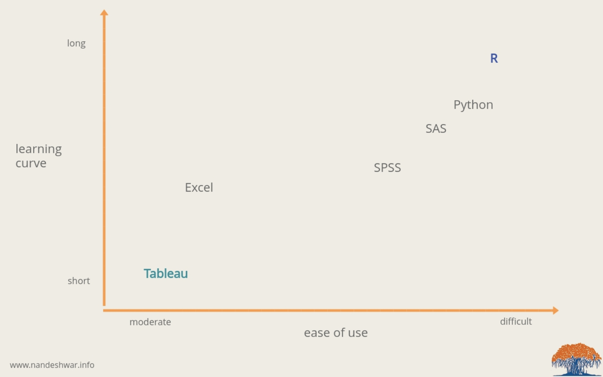
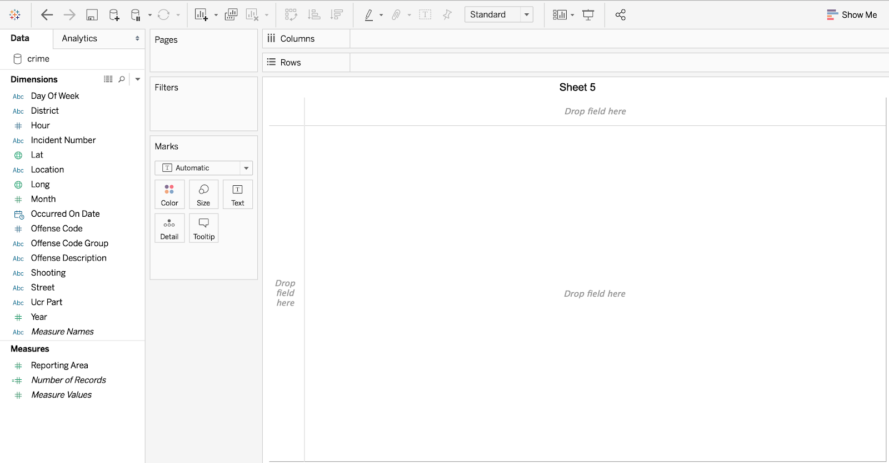
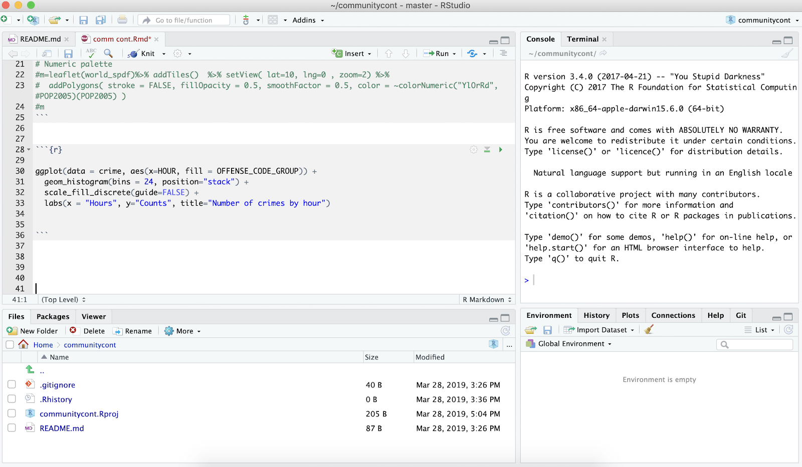
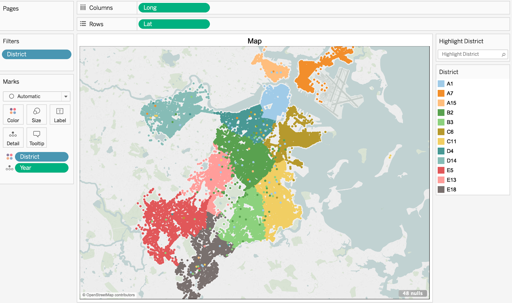
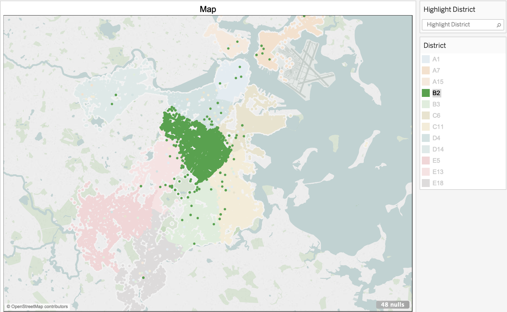
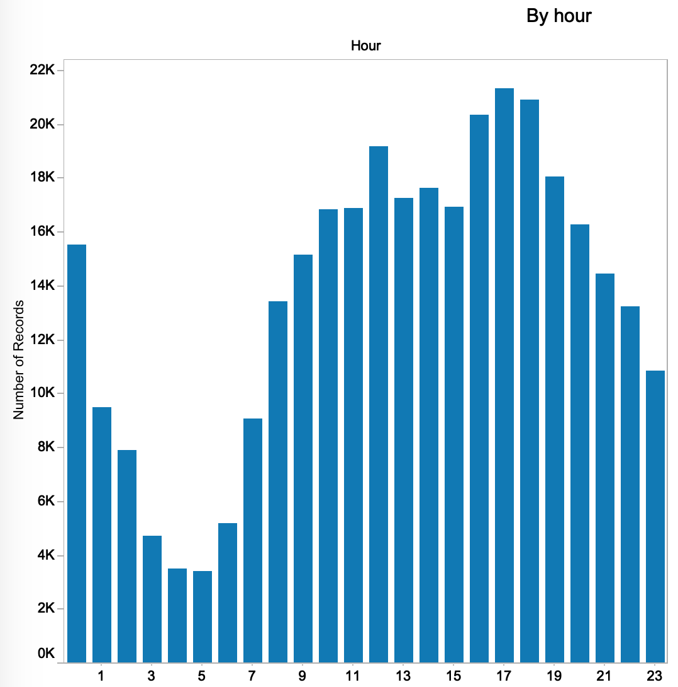
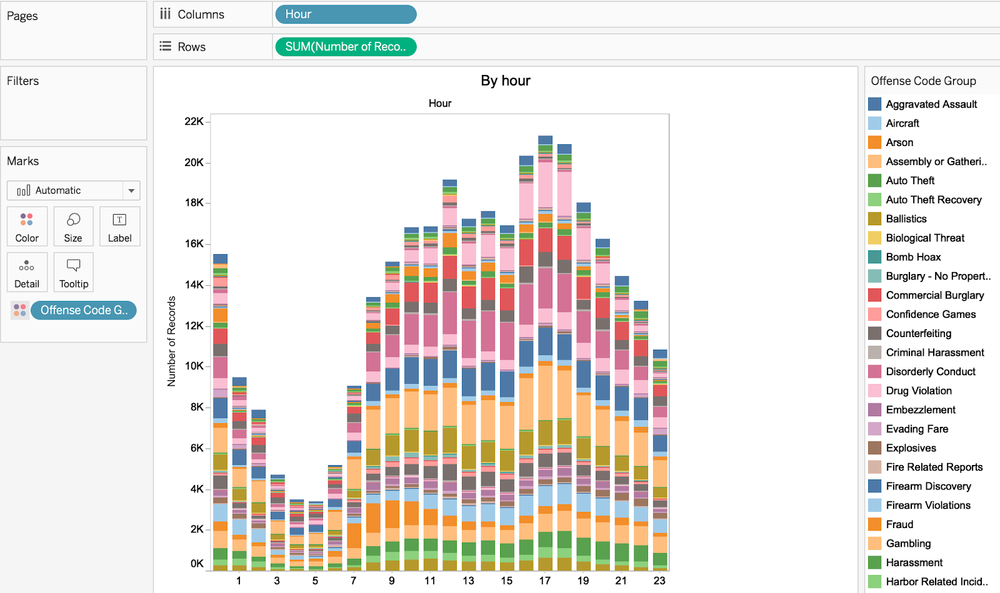

```{r setup, include=FALSE}
knitr::opts_chunk$set(echo = TRUE)
```
```{r}
library(tidyverse)
library(ggplot2)
library(leaflet)
```


# Introduction

In this blog post, we are going to compare graphing methods in R and Tableau. (Mapping, histogram and time series)

For the dataset, we are going to use the Boston crime data (2016 - 2018) from Kaggle.
https://www.kaggle.com/ankkur13/boston-crime-data

The data consists 2,60,760 rows and 17 columns. Each row represents individual incident. 
Here are types of features in columns:

INCIDENT_NUMBER, OFFENSE_CODE, OFFENSE_CODE_GROUP, OFFENSE_DESCRIPTION, DISTRICT, REPORTING_AREA, SHOOTING, OCCURRED_ON_DATE, YEAR, MONTH, DAY_OF_WEEK, HOUR, UCR_PART, STREET, LATITUDE, LONGITUDE, LOCATION.


# General comparison of R and Tableau
Generally, for beginners, Tableau is much easier to start with than R because Tableau has a much lower learning curve. Here is a learning curve comparison of different statistics softwares:





For R, you need to know the basics of data structure and how to code. For example, you need to know how to handle matrix, dataframe, list, etc differently. However, in order to use Tableau, you don’t need to know how to code. If you work around for couple hours, you will be able to understand how to use it. Basically, you need to try dragging and clicking different features how Tableau work.




This is an initial page after you connect the data to Tableau. You can simply drag variables into rows and columns box and Tableau will make the graph automatically.


Here is a initial page for R:



R has more options to customize because we are basically coding to make the plot. The color scheme, margin, plot size, and everything. On the other hand, Tableau gives less customization options, but it works really well in changing minor details because it is quick.


# Comparing in real examples
There are graphical examples from both tools, R and Tableau and we are going to answer some questions worth further considerations. We will start by comparing the mapping methods.


## mapping
First, here are two plots of map describing crime frequencies by Districts in Boston using R and Tableau.

### R
```{r}
crime <- read_csv("crime.csv")
crime <- crime %>%
  filter(Lat != "" & Long !="") %>%
  filter(Lat != -1 & Long != -1)
n <- length(levels(as.factor(crime$DISTRICT)))
par <- colorFactor(topo.colors(n), domain = crime$DISTRICT)

leaflet(crime) %>%
  addTiles() %>%
  addProviderTiles("CartoDB.Positron") %>%
  addCircleMarkers(~Long, ~Lat,
    radius = 1,
    fillColor = ~par(DISTRICT),
    stroke = FALSE, fillOpacity = 0.5
  )

```

As shown above, we can make an interactive map using the leaflet package. We colored each incidents by districts of Boston. From the R code, we can change color scheme by changing color pallete at ‘colorFactor’ line. Also, we can change size of circles by changing the radius in ‘addCircleMarkers’ line and change opacity of circles by changing value for ‘fillOpacity.’

### Tableau



As you can see from this picture, in order to reproduce the same map, we need to drag ‘longitude’ into column box, ‘latitude’ into rows box, and then drag ‘district’ into the marks box, then change color for ‘district.’ If we add the ‘Highlight’ box, we can easily highlight only the district you are interested in. Like this:




Characteristics of using R:

Can handle color changes easily
Easily modified by other users


Characteristics of using Tableau:
Easy to filter out values
Easy to add features


## Stacked Bar Chart Examples

### R

```{r}
ggplot(data = crime, aes(x=HOUR, fill = OFFENSE_CODE_GROUP)) +
  geom_histogram(bins = 24, position="stack") +
  scale_fill_discrete(guide=FALSE) +
  labs(x = "Hours", y="Counts", title="Number of crimes by hour")
```


### Tableau



This is a simple histogram for number of crimes committed by hour. In order to create this plot, we just need to drag ‘hour’ to column and sum of ‘number of records’ to rows. If we simply drag ‘offense code group’ into marks with colors, we get this graph:





So, the simple histogram changed into a stacked bar chart. Also, we can exclude particular offenses by right clicking the factor on the legend and click exclude.


Characteristics of using R:

Customizing themes dependent on various packages


Characteristics of using Tableau:

Easily visualized, no need to worry about margins

Easy to include/exclude certain factors


# Questions to consider


### Do R and Tableau do the same thing or complement each other?

Both tools have been developed to accomplish similar tasks. However, there are some huge differences in terms of efficiencies and purposes.

In R, users are allowed to clean the data as the way they want but it is not possible in Tableau in which data cannot be modified.

They could do the same taks, but they are not complement each other.


### Was one designed to replace the other? 

Not exactly. R is broadly used in data processing and visualizing. However, Tableau is solely for visualizing the data.


### Is one better suited for certain types of tasks?

Kind of. Tableau is very well suited for visualizing the data. It is very easy to use because the software does most of the task automatically. You do not really have to code.


### Do their features differ? If so, how?

Their features differ by a lot. In R, we need to code most of the specifics, including color, bin size, margins, etc. However, in Tableau, you do not really have to worry about those. If you want to edit them, you can simply click and change it manually. This is a double-edged sword because this means that R can automate the process in editing, but in Tableau, you might have to do it all manually.


### How does the quality of documentation compare?

The quality of documentation really depends on the skillset of the person. However, in the most cases, Tableau seem to provide more pleasant view/design of the graphs.


### Are both in active development?

Yes, both are highly recommended softwares to analyze and present the data so they have been in active development.


### Do you experience any problems with either?

One of significant drawbacks using R is the process speed. It high depends on the size of the data and the processing time gets longer for a comparably small amount of data size. For Tableau, it is hard to edit the dataset. 


### Do the learning curves differ?

Yes, they greatly differ. You need to know the basics of data structure and how to code. However, in order to use Tableau, you don’t need to know how to code. If you work around for couple hours, you will be able to understand how to use it. Basically, you need to try dragging and clicking different features how Tableau work.


